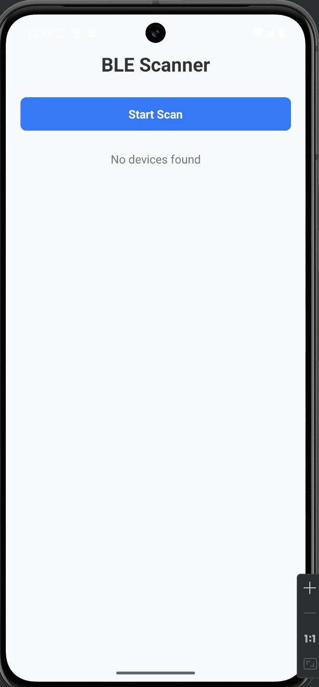
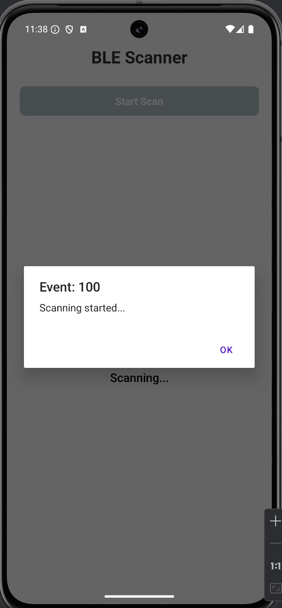
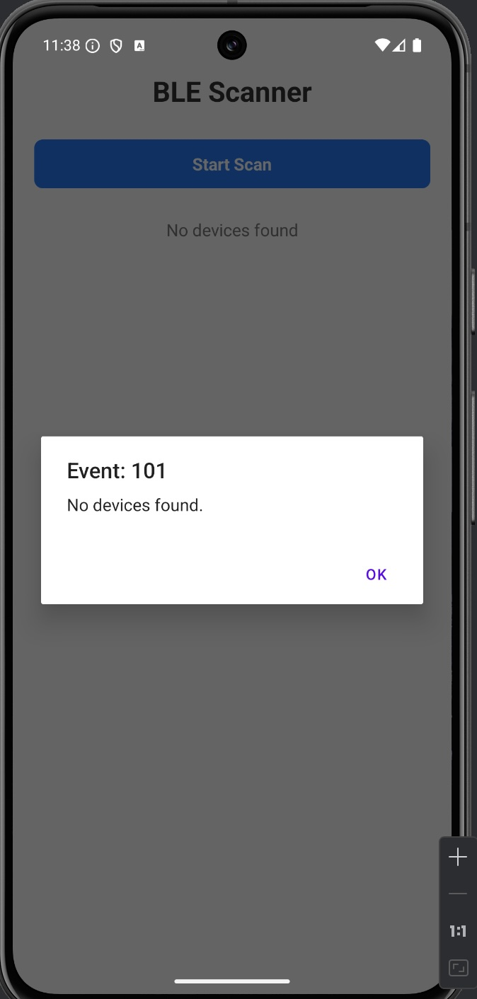

# React Native BLE Module (Bridge)

A React Native Native Module (Bridge) that connects native iOS (Swift/Objective-C) or
Android (Java/Kotlin) code with a React Native TypeScript layer. The module will manage the
functionality of searching for Bluetooth Low Energy (BLE) peripherals.







## Features

- Scanning BLE peripherals
- Notify by events
- Retrieve and display peripheral details

## Setup

1. **Create desired functions developed in Kotlin (Android) or Swift/Objective-C (iOS):**


   ```bash
   //Android
   git clone https://github.com/nirsamon/android-ble.git

   //iOS
   git clone https://github.com/nirsamon/ios-ble.git
   ```

2. **Generate Native Modules:**

    ```bash
    //Android (.aar)
    ./gradlew assembleAllModulesRelease

    //iOS (.xcframework)
    ```

3. **Create the React Native Bridge:**

    ```bash
   git clone https://github.com/nirsamon/kotlin-swift-bridge.git

   //Copies generated .aar files into the bridge project android/libs dir
   //Currently for Android only

   sh setup-libs.sh

   npm pack
   ```

   The output will be in .tgz file (e.g. kotlin-swift-bridge-0.0.1.tgz)

3. **Integrate the bridge into your React Native app:**

    ```bash
    git clone https://github.com/nirsamon/ble-scanner-app.git

    npm install /your path to .tgz bridge file/
    ```

## Usage

**Android Native Module**
- This module follows the Command Pattern for more flexibility in adding more functionalities

**Create your kotlinRun.tsx file**
- You can modify to your own requirements
```bash
import {run} from 'kotlin-swift-bridge';

export enum RunClassNames {
  ScanBleDevices = 'ScanBleDevices',
}

export type RunProps = {
  className: RunClassNames;
  method?: string;
  url?: string;
  params?: any;
};

export const kotlinRun = async (props: RunProps): Promise<any> => {
  const requestStartedAt = new Date().getTime();
  try {
    const resultString = await run(JSON.stringify(props));
    console.log(
      `Execution time for: ${props.className} - ${
        new Date().getTime() - requestStartedAt
      } ms`,
    );
    console.log(`Params: ${JSON.stringify(props.params)}`)

    const result = JSON.parse(resultString);
    if (result.response) {
      result.response = JSON.parse(result.response);
    }

    return result;
  } catch (error: any) {
    console.warn(
      `Execution time for: ${props.className} - ${
        new Date().getTime() - requestStartedAt
      } ms`,
    );
    throw error;
  }
};
```

**Use in your React Native app**
 - className: Command Name from Native Module
 - params: Any data needed by the command in JSON format

```bash
import {RunClassNames, kotlinRun} from './kotlinRun';

<View style={styles.safeContainer}>
      <SafeAreaView style={styles.container}>
        <Text style={styles.title}>BLE Scanner</Text>
        <AppButton
          title="Start Scan"
          onPress={
            const result = await kotlinRun({
                className: RunClassNames.ScanBleDevices,
                params: { 
                scanTimeout: 15000
                },
            });

      console.log('Raw Response:', result);
          }
          disabled={loading}
        />
      </SafeAreaView>
    </View>
```

